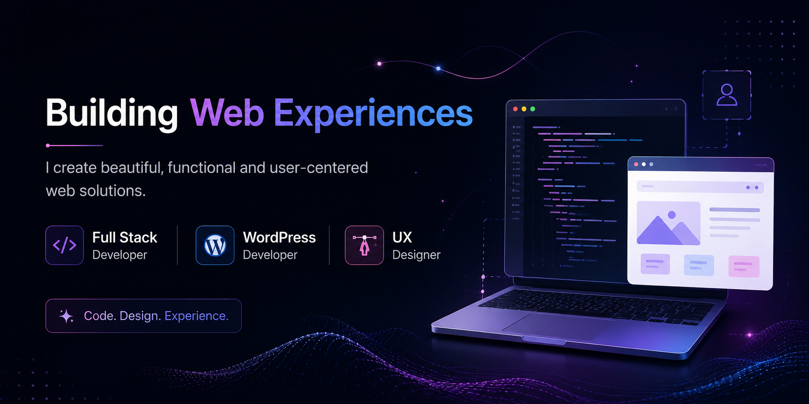

<h1>Hi I'm</h1>
<h1 style="color: #44AEFB;">
  Fatema Abdulla
</h1>

    Information Systems graduate from the University of Bahrain with a passion for full-stack web development and UX-focused digital experiences. Completed a Software Engineering Bootcamp at General Assembly, gaining hands-on experience in modern frontend and backend technologies, alongside WordPress e-commerce development.

 
<!-- Languages and Tools -->

<h2 style="color: #44AEFB">Languages and Tools </h2>

<!-- Icons Resources -->
<!-- https://devicon.dev/ -->
<!-- https://cdn.jsdelivr.net/npm/simple-icons@v3/icons/ -->

<h3>✦ Languages ✦</h3>

<h3>✦ Frameworks & Libraries ✦</h3>

<h3>✦ Databases ✦</h3>
 <h3>✦ Workflow ✦</h3>
 

<!-- Latest Projects -->
<h2 style="color: #44AEFB">Featured Projects</h2>

<table>
  <tr>
    <td width="600">
      <h3>✦ Hangman Game</h3>
      
A classic word guessing game with an interactive UI.

      <a href="https://github.com/Fatema-Abdulla/hangman-game">View Repository →</a>
    </td>
  </tr>
</table>

<table>
  <tr>
    <td width="600">
      <h3>✦ Evenvite</h3>
      
Event management platform with invitations, reservations, and RSVP features.

      <a href="https://github.com/Fatema-Abdulla/Evenvite-Project">View Repository →</a>
    </td>
  </tr>
</table>

<table>
  <tr>
    <td width="600">
      <h3>✦ RoomPickr</h3>
      
Platform for discovering and booking work, study, and meeting spaces through a seamless user experience.

      <a href="https://github.com/Fatema-Abdulla/RoomPickr">View Repository →</a>
    </td>
  </tr>
</table>
<!-- END PROJECT -->

---
<!-- Begin Footer -->
<!-- Icons Resources -->
<!-- https://devicon.dev/ -->

    

<!-- End Footer -->
